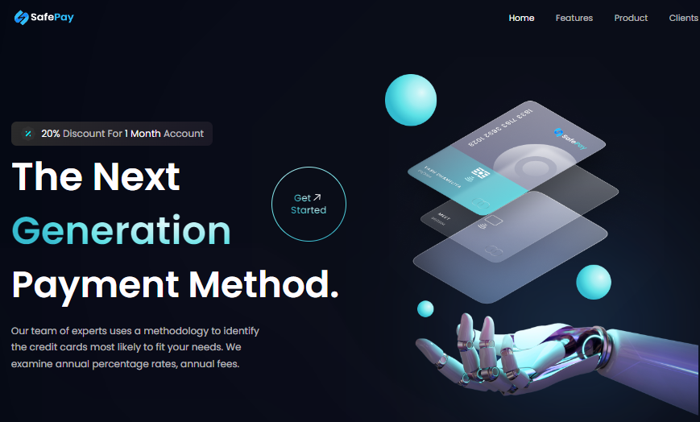

## ⚡ Project Name & Pitch ⚡

Project Name: SafePay

An application used to showcase your modern business product to your customers, built with React, Vite, JavaScript, and Tailwind CSS.

## ⚡ Project Screen Shot(s) ⚡

## ⚡ Installation and Setup Instructions ⚡

Clone down this repository. You will need `node` and `npm` installed globally on your machine.

🌟 Create Project:
`npm create vite@latest`

🌟 Installation:
`npm install`

🌟 To Start Server:
`npm run dev`

🌟 To Visit App:
`http://localhost:5173/`

## ⚡ Reflection ⚡

This was a one week small project built during my internship time period. Project goals included using technologies learned up until this point and familiarizing myself with documentation for new features.

Originally I wanted to build an application that allowed users introduce their modern business product to their clients what they were interested in, such as 'most tagged users'. I started this process by using the `npm create vite@latest` boilerplate with `npm install` , then adding tailwind css by using the `npm install -D tailwindcss postcss autoprefixer` and initialize using the `npx tailwindcss int -p`.

## ⚡ Languages-Frameworks-Tools ⚡

## ⚡ Project Source Link ⚡
 
📌 <a href="#" target="_blank">
      <!-- sqlite, safari, google-chrome are other good icon options -->
</a>
 
📌 <a href="https://www.figma.com/file/ufLAIfvNBqqJ24YCBvNYTd/SafePay?type=design&node-id=0%3A1&mode=design&t=hgQP6RHNNPBqXEWo-1" target="_blank">
      <!-- sqlite, safari, google-chrome are other good icon options -->
</a>

## ⚡ Contact Us ⚡

💬 Ask me about **React, Vite, Java Script, Material UI, Tailwind CSS... or anything [here](https://github.com/yashdhameliya88/safepay/issues)**

 
  
  
  
  
  <a href="#" target="_blank">
      <!-- sqlite, safari, google-chrome are other good icon options -->
  </a>

